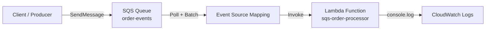
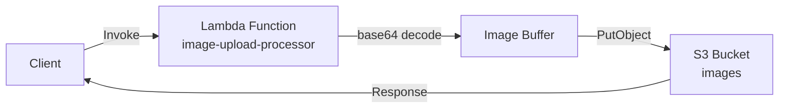
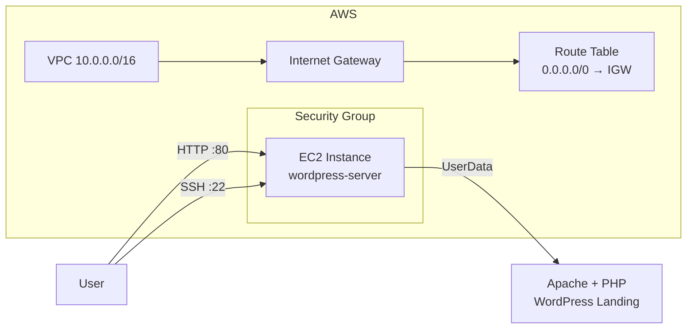
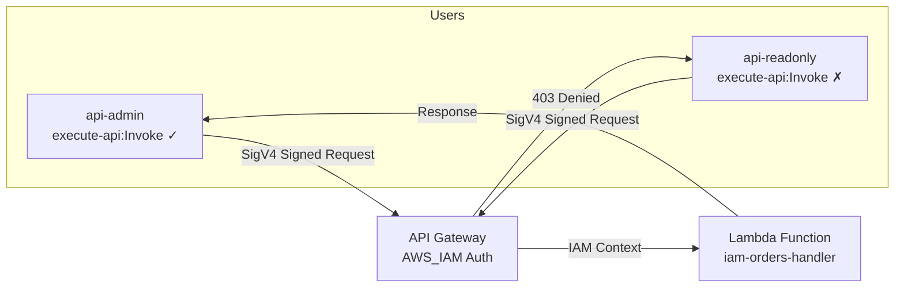
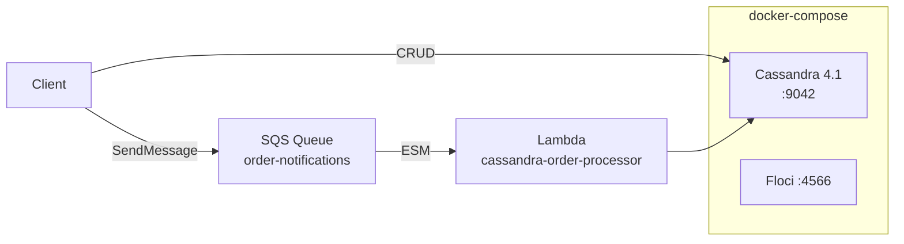
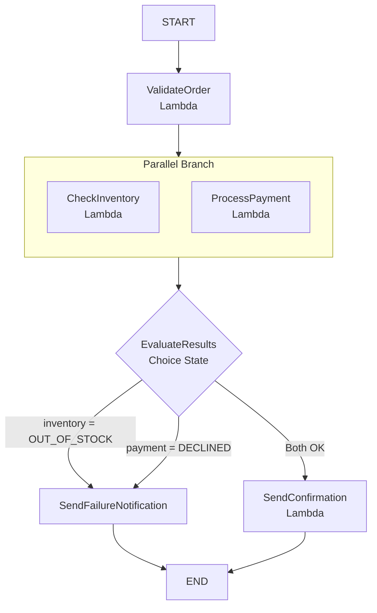
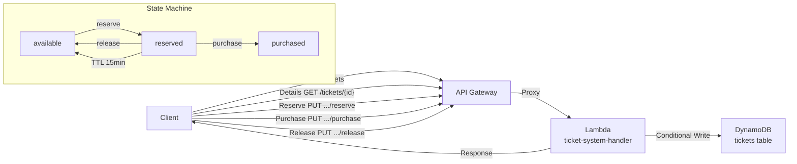
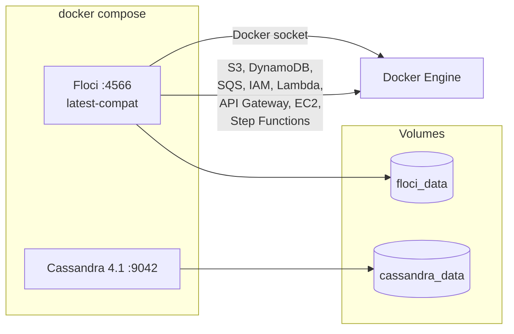

# Architecture

All scenarios run against [Floci](https://github.com/floci-io/floci), an open-source AWS emulator available at `http://localhost:4566`. Services that require real container runtimes (Lambda, EC2) use Docker under the hood.

---

## 1. SQS → Lambda (Event Source Mapping)



**Flow:** Messages sent to the SQS queue are automatically polled by Floci's Lambda event source mapping and delivered to the Lambda function in batches.

**Key concepts:** Event source mapping, batch processing, SQS visibility timeout, Lambda execution context.

**Run:** `task scenario:sqs-lambda`

---

## 2. Lambda Image Upload → S3



**Flow:** The Lambda function receives a base64-encoded image via direct invocation, decodes it, and stores it in an S3 bucket using `PutObject`.

**Key concepts:** Lambda invocation (RequestResponse), base64 encoding, S3 PutObject, environment variables.

**Run:** `task scenario:image-upload`

---

## 3. EC2 with WordPress



**Flow:** Floci EC2 launches a real Docker container with Apache + PHP via UserData. A WordPress-style landing page is served on port 80. SSH access is available via the generated key pair.

**Key concepts:** VPC/subnet/IGW/route table, Security Group, Key Pair, RunInstances, UserData, instance profile.

**Run:** `task scenario:ec2-wordpress`

---

## 4. IAM API Authorization



**Flow:** API Gateway is configured with `AWS_IAM` authorization. Requests must be SigV4-signed with valid IAM credentials. The `api-admin` user (with `execute-api:Invoke` permission) succeeds; the `api-readonly` user (no permission) receives 403.

**Key concepts:** IAM users, API Gateway AWS_IAM auth type, SigV4 request signing, Lambda proxy integration, IAM policy evaluation.

**Run:** `task scenario:iam-api`

---

## 5. Cassandra Orders API



**Flow:** Orders are stored in Cassandra (running as a sidecar container) with CRUD operations. Each order creation also sends a message to SQS, which triggers a Lambda function that reads from Cassandra for processing.

**Key concepts:** Apache Cassandra, CQL keyspace/table design, SQS event bus, Lambda + Cassandra integration, docker-compose sidecar pattern.

**Run:** `task scenario:cassandra-orders`

---

## 6. Step Functions Orchestration



**Flow:** Step Functions state machine orchestrates 4 Lambda functions. `ValidateOrder` runs first (sequential), then `CheckInventory` and `ProcessPayment` run in parallel. A `Choice` state evaluates results and routes to confirmation or failure notification.

**Key concepts:** Step Functions ASL definition, Parallel state, Choice state, Task state, execution history, sequential + parallel orchestration.

**Run:** `task scenario:stepfunctions`

---

## 7. DynamoDB Ticket Selling System



**Flow:** API Gateway routes ticket operations to Lambda, which uses DynamoDB conditional writes for atomic state transitions. Tickets flow through `available → reserved → purchased` (or back to `available` via release or TTL expiry). Race conditions are prevented by DynamoDB's `ConditionalCheckFailedException`.

**Key concepts:** DynamoDB conditional writes (`ConditionExpression`), atomic state machine, TTL-based auto-expiry, API Gateway REST API, pessimistic concurrency control.

**Run:** `task scenario:dynamodb-tickets`

---

## 8. Notification System (Package Tracking)

```mermaid
flowchart LR
    C[Customer] -->|POST /packages<br/>GET /packages/{id}| GW[API Gateway]
    D[Driver App] -->|POST .../events| GW
    C -->|GET/PUT /preferences| GW
    
    GW -->|Proxy| L[Lambda<br/>notification-system-handler]
    
    L -->|CRUD| PKG[(DynamoDB<br/>packages)]
    L -->|CRUD| PREF[(DynamoDB<br/>preferences)]
    L -->|Cache pref| REDIS[(Redis<br/>preference cache)]
    L -->|Enqueue event| SQS[SQS Queue<br/>driver-events]
    SQS -->|ESM| L
    
    L -->|Notification| SNS[SNS Topic<br/>notifications-topic]
    SNS -->|SMS| PHONE[(Phone)]
    SNS -->|Email| EMAIL[(Email)]
    
    subgraph "Driver Events"
        PU[package_picked_up]
        PL[package_location_change]
        PD[package_delivered]
        PU -->|Notify| L
        PL -->|Notify| L
        PD -->|No notification| L
    end
    
    subgraph "ElastiCache (Redis)"
        direction LR
        CACHE[Redis TTL: 300s]
        MISS[Cache Miss → Query DynamoDB]
        HIT[Cache Hit]
    end
```

**Flow:** Customers create packages and set notification preferences (SMS/Email priority). Drivers send location events via API, which update DynamoDB and enqueue to SQS. A Lambda processses the SQS events — for `package_picked_up` and `package_location_change` it checks the user's notification preference (cached in Floci's ElastiCache Redis with 300s TTL via `redis-py`), then dispatches via SNS to the preferred channel(s).

**Key concepts:** API Gateway REST API, DynamoDB conditional updates, SQS event source mapping, ElastiCache (Redis) caching pattern, SNS multi-channel notifications, async event processing.

**Run:** `task notification-system:infrastructure` then `task notification-system:run`

---

## Infrastructure



| Service | Image | Purpose |
|---|---|---|
| Floci | `floci/floci:latest-compat` | AWS emulator (S3, DynamoDB, SQS, SNS, Lambda, IAM, API Gateway, EC2, Step Functions, CloudWatch) |
| Cassandra | `cassandra:4.1` | NoSQL database for orders scenario |
