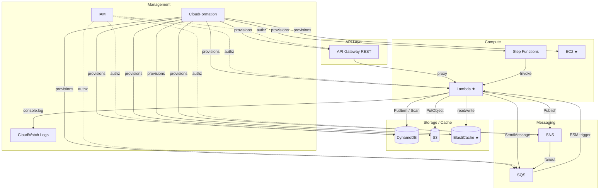

# Floci Supported Services

[Floci](https://floci.io) is an open-source AWS emulator. These 45 services are available on port `4566`. Services marked with ★ run real Docker containers; everything else runs in-process. **Tested** marks services exercised by this project's scenarios.

## Compute

| Service | Runtime | Tested | Tested in | Description | Use cases |
|---|---|---|---|---|---|
| **Lambda** ★ | Real Docker | ✓ | all scenarios | Serverless compute — warm pool, aliases, Function URLs, SQS/Kinesis/DDB Streams ESM | API backends, event processors, file transformers, orchestration tasks |
| **EC2** ★ | Real Docker | ✓ | ec2-wordpress | Virtual machines — VPCs, subnets, SGs, AMIs, key pairs, IGW, UserData, IMDS | WordPress hosting, custom AMIs, SSH-accessible instances |
| **ECS** ★ | Real Docker | | | Container orchestration — clusters, task definitions, services, capacity providers | Run Docker containers at scale, service auto-scaling |
| **EKS** ★ | Real Docker | | | Managed Kubernetes — k3s per cluster, real K8s API server | Container orchestration, K8s-native app testing |

## Storage

| Service | Runtime | Tested | Tested in | Description | Use cases |
|---|---|---|---|---|---|
| **S3** | In-process | ✓ | image-upload, init | Object storage with versioning, multipart upload, pre-signed URLs, Object Lock, event notifications | Store files/images, static website hosting, data lake ingestion |

## Databases & Caching

| Service | Runtime | Tested | Tested in | Description | Use cases |
|---|---|---|---|---|---|
| **DynamoDB + Streams** | In-process | ✓ | dynamodb-tickets, notification-system, sns-fanout | NoSQL key-value/document DB — GSI/LSI, TTL, transactions, batch, Lambda ESM trigger | Session stores, ticketing, order management, event sourcing |
| **ElastiCache (Redis/Valkey)** ★ | Real Docker | ✓ | notification-system | In-memory cache — Redis-compatible, IAM auth, SigV4 validation | Session caching, rate limiting, pub/sub, real-time leaderboards |
| **RDS (PostgreSQL/MySQL)** ★ | Real Docker | | | Relational databases — IAM auth, JDBC-compatible | Transactional workloads, relational data, SQL queries |

## Messaging & Eventing

| Service | Runtime | Tested | Tested in | Description | Use cases |
|---|---|---|---|---|---|
| **SQS** | In-process | ✓ | sqs-lambda, cassandra-orders, notification-system, sns-fanout | Managed message queues — Standard & FIFO, DLQ, visibility timeout, batch | Decouple microservices, buffer Lambda triggers, async job queues |
| **SNS** | In-process | ✓ | sns-fanout, notification-system | Pub/sub messaging — topics, subscriptions (SQS/Lambda/HTTP), SMS, Email | Fan-out events, alerting, multi-channel notifications |
| **EventBridge + Scheduler** | In-process | | | Event bus + scheduled tasks — custom buses, rules, targets (SQS/SNS/Lambda) | Event-driven architectures, cron jobs, scheduled Lambda triggers |
| **Kinesis** | In-process | | | Real-time data streaming — streams, shards, enhanced fan-out, split/merge | Clickstream ingestion, log aggregation, real-time analytics |
| **MSK (Kafka)** ★ | Real Docker | | | Managed Kafka — Redpanda-based, Kafka protocol compatible | Event streaming, pub/sub at scale, log compaction |

## API

| Service | Runtime | Tested | Tested in | Description | Use cases |
|---|---|---|---|---|---|
| **API Gateway REST** | In-process | ✓ | dynamodb-tickets, iam-api, notification-system, sns-fanout | REST API management — resources, methods, stages, Lambda proxy, MOCK, AWS integrations | Expose Lambda via HTTP, API key auth, request/response transformation |
| **API Gateway v2** | In-process | | | HTTP + WebSocket APIs — routes, integrations, JWT authorizers, stages | Real-time apps, chat, lightweight HTTP APIs, WebSocket broadcast |

## Orchestration

| Service | Runtime | Tested | Tested in | Description | Use cases |
|---|---|---|---|---|---|
| **Step Functions** | In-process | ✓ | stepfunctions | Workflow orchestration — ASL execution, task tokens, execution history | Order processing, approval workflows, ETL pipelines |

## Security & Identity

| Service | Runtime | Tested | Tested in | Description | Use cases |
|---|---|---|---|---|---|
| **IAM** | In-process | ✓ | all stacks | Identity & access management — users, roles, groups, policies, instance profiles, access keys | Authz for all services, cross-account access, service roles |
| **STS** | In-process | | | Security token service — AssumeRole, WebIdentity, SAML, federation | Temporary credentials, cross-account access, federated auth |
| **Cognito** | In-process | | | User authentication — user pools, app clients, auth flows, JWKS/OpenID endpoints | User sign-up/sign-in, social login, OAuth 2.0 flows |
| **KMS** | In-process | | | Key management — encrypt/decrypt, sign/verify, data keys, aliases | Server-side encryption, envelope encryption, digital signatures |
| **ACM** | In-process | | | Certificate management — issuance, validation lifecycle | HTTPS termination, custom domain names |
| **Secrets Manager** | In-process | | | Secrets storage — versioning, resource policies, rotation, tagging | DB credentials, API keys, any sensitive config |
| **SSM Parameter Store** | In-process | | | Config & secret management — version history, labels, SecureString, tagging | App config, feature flags, hierarchical parameter storage |

## Management & Observability

| Service | Runtime | Tested | Tested in | Description | Use cases |
|---|---|---|---|---|---|
| **CloudFormation** | In-process | ✓ | init | Infrastructure as Code — stacks, change sets, resource provisioning | Deploy IaC templates locally, test stack updates, CI/CD pipelines |
| **CloudWatch Logs** | In-process | ✓ | all Lambdas | Log management — log groups, streams, ingestion, filtering, metric filters | Centralized logging, log search, operational dashboards |
| **CloudWatch Metrics** | In-process | | | Metrics & alarms — custom metrics, statistics, alarm thresholds | App monitoring, scaling signals, performance tracking |
| **AppConfig + AppConfigData** | In-process | ✓ | feature-flags | App config management — feature flags, config profiles, deployments | Dynamic config, canary config rollouts |
| **AWS Backup** | In-process | | | Backup management — vaults, plans, on-demand jobs, recovery points | Backup automation, disaster recovery testing |

## Data & Analytics

| Service | Runtime | Tested | Tested in | Description | Use cases |
|---|---|---|---|---|---|
| **Athena** | In-process + DuckDB | | | SQL query service — Glue-backed views over S3 data, DuckDB engine | Ad-hoc analytics, query S3 data with SQL, CSV/Parquet/JSON |
| **Glue** | In-process | | | Data catalog — Schema Registry for Avro/JSON Schema/Protobuf, consumed by Athena | Metadata management, schema evolution, ETL metadata |
| **Data Firehose** | In-process | | | Streaming data delivery — records flushed as NDJSON to S3 | Log delivery, data lake ingestion, real-time ETL |

## CI/CD & Developer Tools

| Service | Runtime | Tested | Tested in | Description | Use cases |
|---|---|---|---|---|---|
| **CodeBuild** | In-process + Docker | | | CI/CD — real Docker containers for builds, logs to CloudWatch, artifacts to S3 | Build & test pipelines, artifact generation |
| **CodeDeploy** | In-process | | | Deployment automation — Lambda traffic shifting, lifecycle hooks, auto-rollback | Blue/green deployments, canary releases |

## Networking & DNS

| Service | Runtime | Tested | Tested in | Description | Use cases |
|---|---|---|---|---|---|
| **ELB v2** | In-process | | | Load balancing — ALB + NLB, target groups, listeners, health checks | Distribute traffic, auto-scaling integration |
| **Route53** | In-process | | | DNS management — hosted zones, record sets, health checks, change tracking | DNS resolution, domain routing, health checks |

## AI / ML

| Service | Runtime | Tested | Tested in | Description | Use cases |
|---|---|---|---|---|---|
| **Bedrock Runtime** | In-process (stub) | | | AI/ML model inference — Converse & InvokeModel (stub, streaming returns 501) | Prototype GenAI integrations, test SDK compatibility |

## Other

| Service | Runtime | Tested | Tested in | Description | Use cases |
|---|---|---|---|---|---|
| **SES + SES v2** | In-process | | | Email sending — identity verification, DKIM, feedback attributes | Transactional emails, verification flows, notification emails |
| **Textract** | In-process | | | Document analysis — text extraction from documents | OCR, document processing, form data extraction |
| **Transfer Family** | In-process | | | File transfer — SFTP, FTP, FTPS | Ingest files from external partners, legacy integration |
